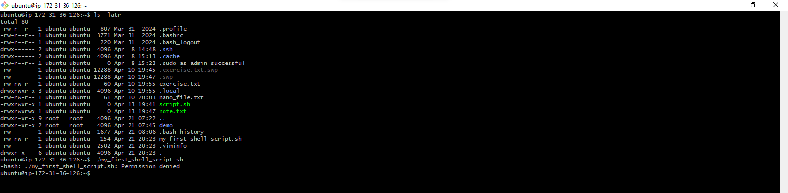
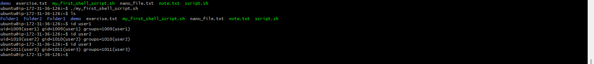

# Shell Scripting

WIth the thousands of commands available to the command line user, how can we remember them all? The answer is, we don't. The real power of the computer is its ability to do the work for us. To get to do that, we use the power of the shell to automate things i.e. we write shell scripts.

## What is Shell Scripting?

Imagine you're tasked with setting up new workstations and user accounts regularly at your job. Instead of manually creating each folder and user account, a simple shell script serves as your efficient digital helper.
Shell scripting is the process of writing and executing a series of instructions in a shell to automate tasks. A shell script is essentially a script or program written in a shell language, such as _**Bash**_, _**sh**_, or _**Powershell**_.

## Task 

**Task 1**: Create a folder on an ubuntu server and name it shell-scripting

Type the following command on your server `mkdir shell-scripting`

**Task 2**: Using the vim editor, create a file called _my_first_shell_script.sh_

Run `vi my_first_shell_script.sh`. This command opens up the vim text editor with the file name, press i to enter the insert mode.

**Task 3**:  Put the following shell script code into the file

```
#/bin/bash

# Create directories
mkdir Folder1
mkdir Folder2
mkdir Folder3

# Create users
sudo useradd user1
sudo useradd user2
sudo useradd user3

```

**Task 4**: Save the file

After writing the above code into the file, press **:wq** to save the file and to exit the vim editor.

**Task 5**: cd into the shell-scripting directory

Type `cd shell-scripting` 

**Task 6**: Confirm the file has indeed been created

Type `ls -latr`

**Task 7**: Execute the script

Run `./my_first_shell_script.sh`

N.B You will get a permissions denied error. This is because the script lacks execution permissions



**Task 8**: Add the execute permissions for the owner to be able to execute the file.

Run `chmod +x my_first_shell_script.sh`

**Task 9**: Run the script again. Then confirm the folders and users have been created

Run `./my_first_shell_script.sh` to execute the file.

Run `ls` to see the created folders

Run `id user1`, `id user2`, `id user3` to confirm the users have been created.



