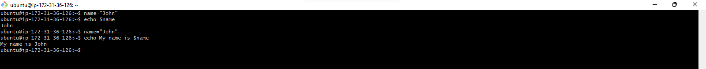

# Shell Scripting

WIth the thousands of commands available to the command line user, how can we remember them all? The answer is, we don't. The real power of the computer is its ability to do the work for us. To get to do that, we use the power of the shell to automate things i.e. we write shell scripts.

## What is Shell Scripting?

Imagine you're tasked with setting up new workstations and user accounts regularly at your job. Instead of manually creating each folder and user account, a simple shell script serves as your efficient digital helper.
Shell scripting is the process of writing and executing a series of instructions in a shell to automate tasks. A shell script is essentially a script or program written in a shell language, such as _**Bash**_, _**sh**_, or _**Powershell**_.

## Task 

**Task 1**: Create a folder on an ubuntu server and name it shell-scripting

Type the following command on your server `mkdir shell-scripting`

**Task 2**: Using the vim editor, create a file called _my_first_shell_script.sh_

Run `vi my_first_shell_script.sh`. This command opens up the vim text editor with the file name, press i to enter the insert mode.

**Task 3**:  Put the following shell script code into the file

```
#/bin/bash

# Create directories
mkdir Folder1
mkdir Folder2
mkdir Folder3

# Create users
sudo useradd user1
sudo useradd user2
sudo useradd user3

```

**Task 4**: Save the file

After writing the above code into the file, press **:wq** to save the file and to exit the vim editor.

**Task 5**: cd into the shell-scripting directory

Type `cd shell-scripting` 

**Task 6**: Confirm the file has indeed been created

Type `ls -latr`

**Task 7**: Execute the script

Run `./my_first_shell_script.sh`

N.B You will get a permissions denied error. This is because the script lacks execution permissions


**Task 8**: Add the execute permissions for the owner to be able to execute the file.

Run `chmod +x my_first_shell_script.sh`

**Task 9**: Run the script again. Then confirm the folders and users have been created

Run `./my_first_shell_script.sh` to execute the file.

Run `ls` to see the created folders

Run `id user1`, `id user2`, `id user3` to confirm the users have been created.


## What is a Shebang (#!/bin/bash) ?

Notice that, at the beginning of the shell script, we have `#!/bin/bash` written there. This is what is called **shebang**. It is a special notation used in Unix-like operating systems like Linux, to specify the interpreter that should be used to execute the script. In this case, _**#!/bin/bash**_ specifically indicates that the _**Bash**_ shell should be used to interpret and execute the script.

## Variable Declaration and Initialization

In programming generally, not just shell scripting, _**variables**_ are essential for creating dynamic and flexible programs. Variables can store data of various types such as numbers, strings and arrays. You can assign values to variables using the = operator, and access their values using the variable name preceded by a **$** sign.

Let's explore examples:

```
Example : assigning value to a variable:

name="John"

```

From the example above, _**"John"**_ was assigned to the variable _**"name"**_.

## Retrieving value from a variable

After assigning a value to a variable, as shown in the previous example where we assigned "John" to variable "name", you can utilize this variable in various ways in your script or program. One way to use or retrieve the value is by echoing it back to the console. This is done using the _**echo**_ command in shell scripting

```
echo $name

```

This command instructs the shell to print the value of name to your screen, which, in our case, would output _**John**_



## Adding Comments in Bash Scripts

Comments are essential in programming, serving as notes to the programmer and anyone else who might read the code. They explain what the script or parts of the script do, making the code easier to understand and maintain. 

This section will guide you on how to add comments in Bash Scripts.

_**What Are Comments?**_

Comments are lines in your code that are ignored by the interpreter. In Bash scripts, comments help document the purpoose and logic of your code, making it easier for others to follow and understand the script's functionality.

_**Single Line comments**_

Single-line comments in Bash scripts start with the **#** symbol. Anything following this symbol on the same line is treated as a comment and is not executed.

```
# This is a single-line comment in Bash
echo "Hello, you are learning Bash Scripting on DAREY.IO!" # This is also a comment, following a command.

```

_**Using Multiple Single-Line Comments:**_

```
# This is another way to create
# a multi-line comment. Each line
# is prefixed with a # symbol.
echo "Here is an actual code that gets executed"

```

_**Best practices for commenting**_

* Clarity: Write clear and concise comments that explain the "why" behind the code.
  
* Maintainability: Keep comments updated as you modify the code to ensure they remain relevant and helpful

* Usefulness: Comment on complex or non-obvious parts of the script to provide insights into your thought process and decision-making.

* Avoid Overcommenting: Don't comment on every line of code, especially if the code is self-explanatory. Focus on parts that benefit from additional explanation.
